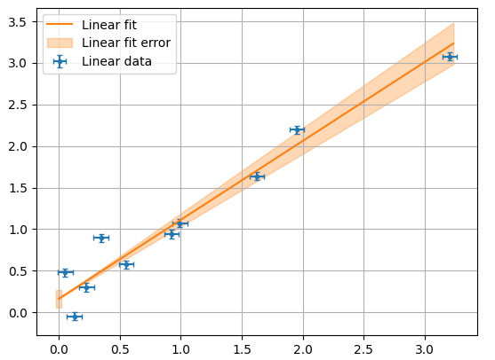

# mpl-uncertainties

An Uncertainties package for Matplotlib

## Examples
Simple linear fit example:
```python
import numpy as np
import matplotlib.pyplot as plt
from uncertainties import ufloat, unumpy as unp
import mpl_uncertainties as unplt

x_val = np.array([0.5, 1.3, 2.1, 3, 4.2, 4.9])
x_err = x_val*0.05 # 5% of the reading
y_val = np.array([0.5, 1.3, 2.1, 3, 4.2, 4.9])
y_err = y_val*0.05 # 5% of the reading

x = unp.uarray(x_val, x_err)
y = unp.uarray(y_val, y_err)

slope, intercept = odr_linear_regression(x, y)

unplt.errorbar(x, y, label="Linear data")
unplt.fit(x, slope, intercept, label='Linear fit')

plt.legend()
plt.grid()
plt.show()
```
Result:
TODO upload the real result image when the library will be available


For for examples documentation please visit:
https://mpl-uncertainties.readthedocs.io/en/latest/examples/

## Installation

You can install using `pip`:

```bash
pip install mpl_uncertainties
```

## Development Installation

```bash
pip install -e ".[dev]"
```

## Install development version with git/pixi

```bash
git clone https://github.com/andrewgsavage/mpl-uncertainties.git
cd mpl-uncertainties

pixi install

# run tests
pixi run test

# generate baseline images for tests
pixi run test_mpl_generate

# build docs
pixi run build-doc
```
